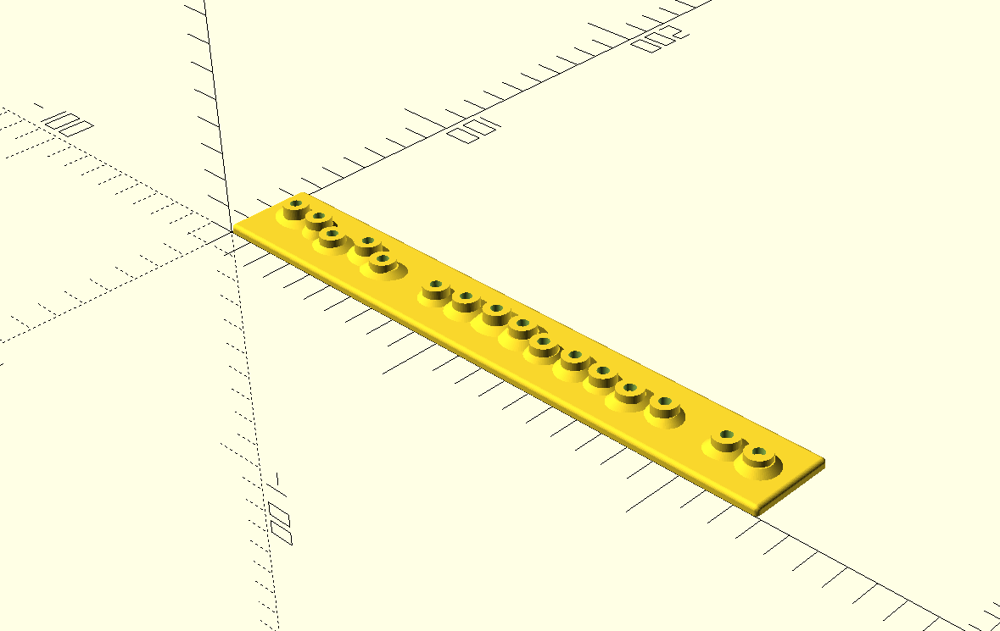

# Sugar Cane Field



A procedurally generated sugar cane field for tabletop wargaming. It is designed to be used as an alternative to the first two steps for the following sugarcane terrain tutorial. https://bloodandpigment.com/2024/10/14/how-to-make-sugarcane-terrain/

Designed primarily for historical games set in the Caribbean during the late 17th and early 18th centuries, but equally suitable for pirate games, colonial settings, fantasy, or any scenario requiring dense crop fields.

## Features

- Fully parametric OpenSCAD model
- Procedurally randomized terrain
- Deterministic generation using a seed value
- Multiple printable field variations
- Designed for FDM printing
- No hand placement of individual rows required

Each generated model contains slight variation while maintaining believable agricultural row spacing.

## Parameters

The model exposes a number of parameters that can be customized.

Typical parameters include:

| Parameter | Description |
|------------|-------------|
| `seed` | Random generation seed |
| `length` | Field length |
| `width` | Field width |
| `row_spacing` | Distance between sugar cane rows |
| `terrain_height` | Base thickness |
| `noise_amount` | Surface roughness |

Changing the seed produces a unique layout while preserving overall dimensions.

## Building

Generate a single STL:

```bash
openscad \
    -D "seed=1" \
    -o sugarcane-field.stl \
    sugarcane-field.scad
```

Generate multiple randomized variants:

```bash
make
```

The included Makefile generates six different field variants by overriding the `seed` variable.

Example output:

```
build/
├── terrain_seed_1.stl
├── terrain_seed_2.stl
├── terrain_seed_3.stl
├── terrain_seed_4.stl
├── terrain_seed_5.stl
└── terrain_seed_6.stl
```

To generate more:

```bash
make COUNT=25
```

## Random Generation

The generator is deterministic.

Running:

```bash
-D "seed=4"
```

will always produce the same field.

Changing the seed changes row placement and procedural variation without affecting the overall dimensions.

## Terrain Surface

The field is intended to support a lightly irregular ground surface rather than a perfectly flat base.

Current development focuses on procedural terrain generated directly from OpenSCAD geometry. Future work may include optional post-processing tools that apply additional organic surface variation to generated meshes.

## Printing Recommendations

Recommended settings:

- 0.4 mm nozzle
- 0.20 mm layers
- PLA, PETG, or ASA
- No supports
- 15–20% infill

The model is designed to lie flat on the print bed.

## Intended Games

Examples include:

- Blood & Plunder
- Warhammer Fantasy
- Bolt Action
- Frostgrave
- Silver Bayonet

## Historical Inspiration

The layout is inspired by sugar plantations in Jamaica and throughout the Caribbean during the late 1600s and early 1700s, where sugar cane was planted in long, parallel rows separated by narrow walking paths for cultivation and harvesting.

The goal is historical plausibility rather than recreating a specific plantation.

## License

See the repository root for licensing information.
